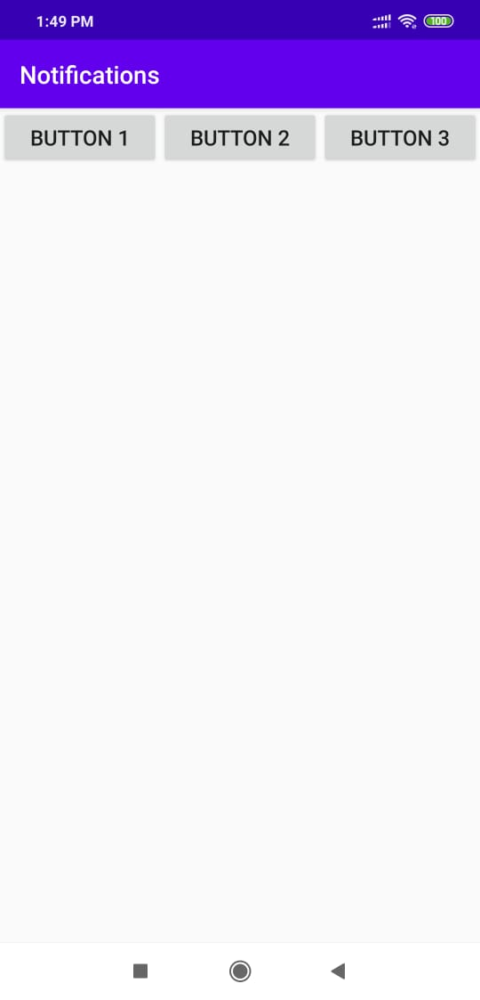
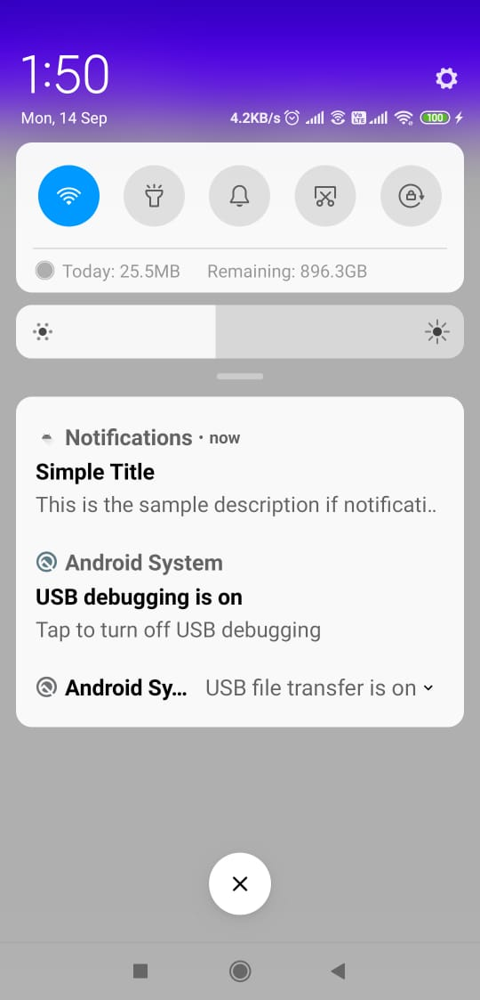
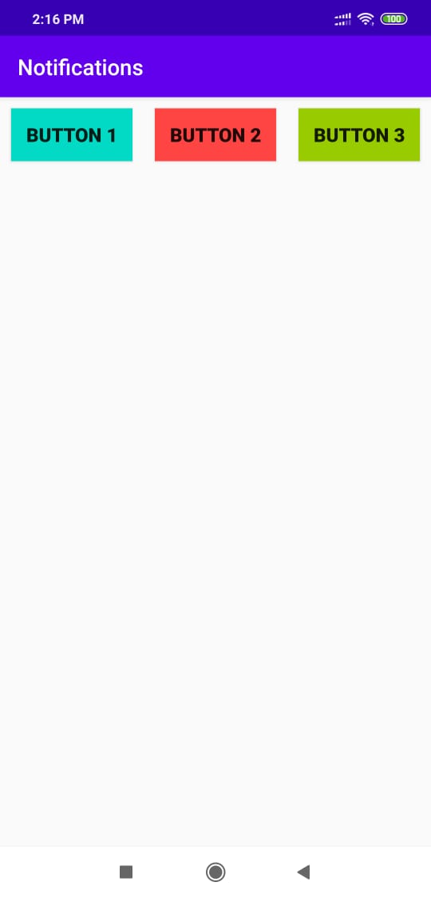
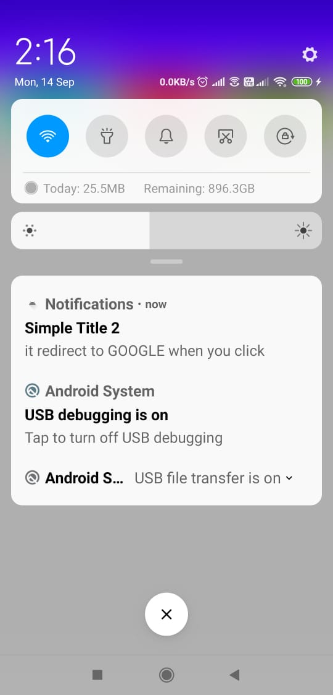
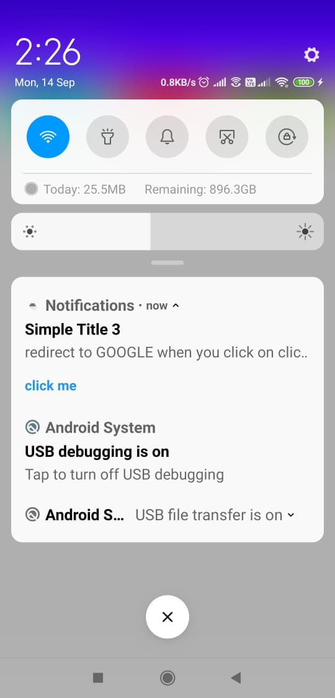
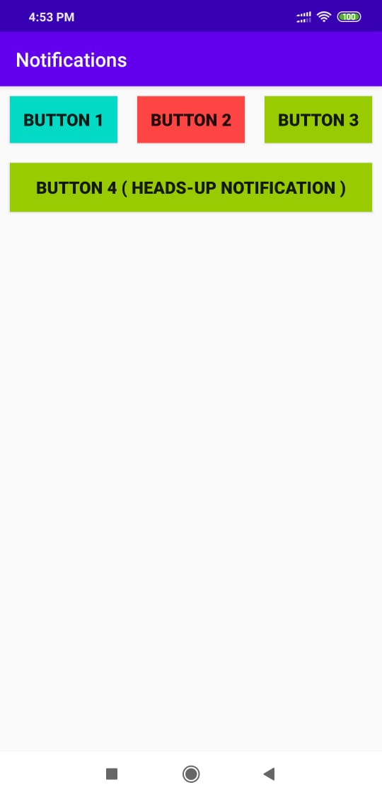

# ANDROID_11_Notification

### on clicking button one 
 

### on clicking button two, notification shows which redirect to ggogle.com
 

### on clicking button 3 notification shows on which you have to click on "click me" to redirect
 
  
## heads up notifications shows by clicking button 4 (unable to catch screenshot)

          
